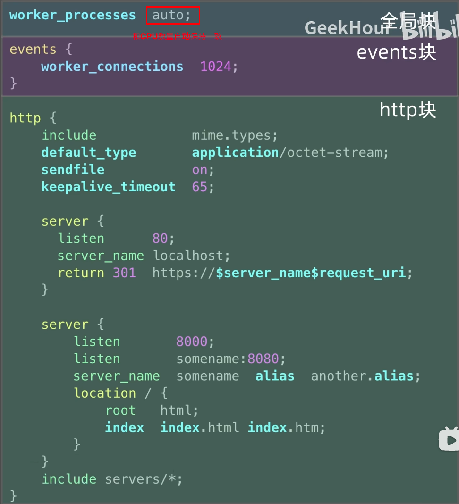

# Ningx
## 1. 安装
### 方式1
```shell
# Linux
sudo apt update
sudo apt install nginx

# Mac
brew install nginx

# Windows
scoop install nginx
choco install nginx
```

### 方式2
```shell
docker pull nginx
```

## 2. 启动和停止
### 启动
```shell
# 没有任何消息就是启动成功了，默认监听80端口
nginx
```

### 常用命令
```shell
nginx -s signal

signal可以是如下：
quit: 优雅停止
stop: 立即停止
reload: 重新加载配置文件
reopen: 重新打开日志文件
```

### 查看各种配置文件的路径
```shell
# 可以用下面的命令来查看配置文件的路径: nginx.conf
# 常见的配置文件的位置：
# /etc/nginx/conf
# /usr/local/etc/nginx
# /opt/homebrew/etc/nginx
nginx -V
nginx -t # 也可用来检查配置文件是否错误
```

### 配置块



